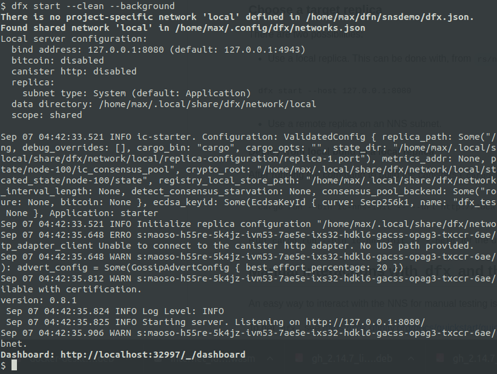
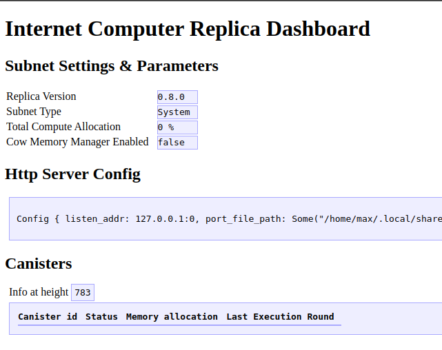

# Local NNS and SNS

Welcome to the world of the Network Nervous System.  In this tutorial we will show you how to deploy the NNS locally and how you can decentralize your dapp using the SNS.

## Setup
Clone this project:
```bash
git clone https://github.com/dfinity/snsdemo.git
cd snsdemo
```

## Project contents
Before we get started, let's have a quick look at this repo.  It contains a simple toy application and some scripts to help you through this tutorial.  Have a look at dfx.json and the src directory.  Then let's deploy it:

```bash
dfx start --host 127.0.0.1:8080 --background
npm ci
dfx deploy
echo http://$(dfx canister id smiley_dapp_assets).localhost:8080
```
Open the URL printed by that last line and you should see the smiley dapp:


After this tutorial is complete we hope that you will experiment using the same commands with your own projects.

## Install dfx
This dfx functionality has not been released yet, so you will need a special build, which you can obtain as follows:
```bash
DFX_VERSION=0.12.0-beta.2 sh -ci "$(curl -fsSL https://sdk.dfinity.org/install.sh)"
```
Also, to use the non-production build, it is important to remove the `dfx` version from `dfx.json`, otherwise your calls to dfx will simply be redirected to a normal production build and new functionality will not work.  You can do this with:
```
cat <<<$(jq 'del(.dfx)' dfx.json.original) >dfx.json
```

Now we should now be able to see the help pages for the NNS commands:
```bash
dfx nns --help
dfx nns install --help
dfx nns import --help
```

## Start a local testnet
Make sure that your `$HOME/.config/dfx/networks.json` has the following configuration for the "local" network:
```bash
{
  "local": {
    "bind": "127.0.0.1:8080",
    "type": "ephemeral",
    "replica": {
      "subnet_type": "system"
    }
  }
}
```
Note:
* The "old" method of configuring networks is in `dfx.json`.  The old method is deprecated but still works and
  will be supported until Spring 2023.  The above is equivalent to including this in your `dfx.json`:
  ```
  {
    "networks": {
        "local": {
            "bind": "127.0.0.1:8080",
            "type": "ephemeral",
            "replica": {
                "subnet_type": "system"
            }
        }
    }
  }
  ```

Now you can start your local testnet:
```bash
dfx stop
dfx start --clean --host 127.0.0.1:8080 --background
```
You should see something like this:



Some things to note:
* The `--clean` flag is important, as system canisters have pre-assigned canister IDs that must be vacant before we install them.
* In the output, see the line "subnet type: System".  This confirms that our configuration has taken effect.
* Note the dashboard URL at the end of the output.  Open it in a browser.  It should show that there are no canisters currently installed.  Keep this page open; as the tutorial progresses you will be able to see canisters being installed.

  

## Install NNS canisters
The NNS is the decentralization mechanism for the Internet Computer.  Normally it is run on many computers and the only way of making changes to it is by submitting proposals and letting neuron holders vote on the proposals.  For you to be able to experiment by yourself, we will install a test version that allows you to make changes locally by yourself. 

```bash
dfx nns install
```

You should see something like this:


SNIP


Let's see what we have.

### Internet Identity
Click on the `internet_identity` URL printed in the terminal.  This is a login service for dapps, similar to "login with google" but without the advertising.  Check that you can create an identity and log in.  You won't see much after you have logged in but you will have an identity that you can use on your testnet.

The local installation differs from production to make it more useful for automated testing.
* The captcha is always "a".
* No hardware key is needed to log in.
This is of course tremendously insecure but very useful for testing.

If you wish, you can add a login service to the toy dapp using `internet_identity`.

### NNS Dapp
Click on the `nns-dapp` URL.  You should be able to log in with your new identity.

The NNS Dapp acts as a wallet.  You will need toy ICP tokens to test with.  Note that at the bottom of the menu there is a "Get ICPs" button with which you can award yourself ICP.  Free ICP are limited but you can make yourself a millionaire.

To be able to make decisions in your local testnet you will need a neuron with hefty voting power.  In the real world, neuron ownership is distributed but in the testnet, if you make yourself a neuron with 500 million ICP and an 8 year dissolve delay you will be able to vote through proposals under almost any circumstances.

Finally, look to see what proposals you can vote on.  Disappointingly, if you look at the voting tab you will see no proposals but, actually, setting up the local NNS involved passing some proposals.  You can see this if you filter by proposal status == executed and select all topics.  You will be able to make proposals locally and vote on them.

### Import did files
To interact with the back end governance canisters you will need the API definitions.  So far the commands have not altered the local project at all, but now we will add information about the NNS to the local project:
```
dfx nns import
```
You look in your dfx.json you should see the NNS canisters listed and you should have did files.  For example:
```
jq '.canisters["nns-sns-wasm"]' dfx.json
ls candid/nns-sns-wasm.did
```

## Decentralize the Smiley Dapp
Now we will hand over control of the local Smiley Dapp to the community; the community of just you, the reader, but the process is the same for handing over control of a real dapp on mainnet to the community at large.

### Redeploy the smiley dapp
We deployed the smiley dapp before but then wiped the network.  Let's recreate it:
```
npm ci
dfx deploy --with-cycles 1000000000000 smiley_dapp
dfx deploy --with-cycles 1000000000000 smiley_dapp_assets
```

### Install sns
The sns functionality is not yet integrated in dfx; this is work in progress.  We will take a shortcut.  Get the sns binary:
```bash
"$HOME/.cache/dfinity/versions/$(dfx --version | awk '{print $2}')/sns" ./bin/
```

### Configure an SNS
You will need to decide some things such as token name and token parameters.  To do this:
```
./bin/sns init-config-file new
```
This will create a configuration file:
```
ls sns_init.yaml
```
Open it in an editor.  You will see some blanks that need to be filled in with your SNS parameters.  Fill them in.

You can check whether your entries are complete and valid by running:
```
sns init-config-file validate
```
If you just want a random config that works, run:
```
./bin/sns-configure
```

### Create an SNS
Creating an SNS is expensive; the price is set at 50 trillion cycles.  Make sure that your wallet has at least that much:
```
dfx wallet balance
```
If you need more, you can buy yourself some in the canisters tab of the NNS UI, by adding your wallet canister and sending it cycles.

Now, you can deploy:
```
./bin/sns deploy
```

You should be able to see the SNS canisters in your dfx.json:
```
jq '.canisters' dfx.json
```
### Hand over control
You need to transfer control of the smiley face canisters to the SNS.

Placeholder:
```
./bin/sns-handover
```

### Neurons
In the NNS UI, make sure that you have a large neuron so that you can passs proposals.

### Propose to start the SNS
```
bin/sns-start-swap
```
In the NNS Dapp UI go to the launchpad.

You should see a proposal.
* You may need to refresh

Vote for the proposal to pass.

### Invest
Once the proposal has passed, refresh the launchpad. You should now see an opportunity to invest.

Buy tokens in the SNS.  If you buy enough, the SNS will complete immediately which is better for testing than waiting for the proposal time window to close.

### Finalize the SNS
```
bin/sns-finalize-swap
```
